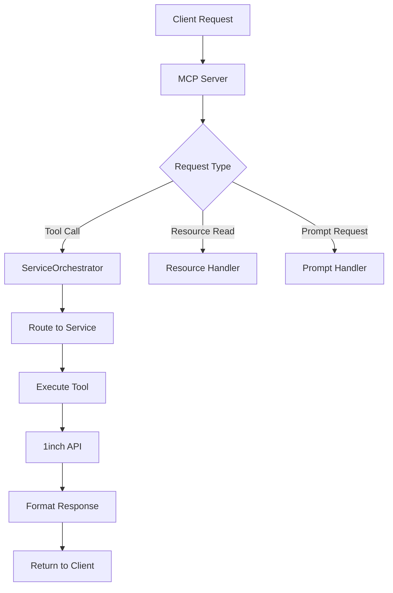
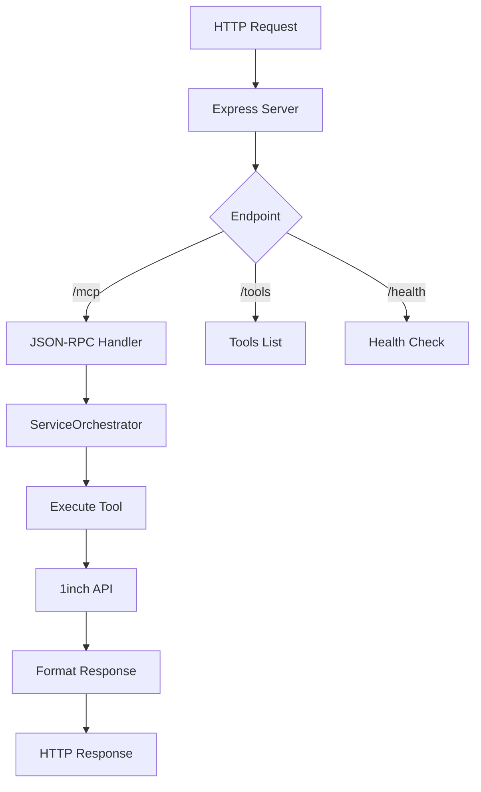
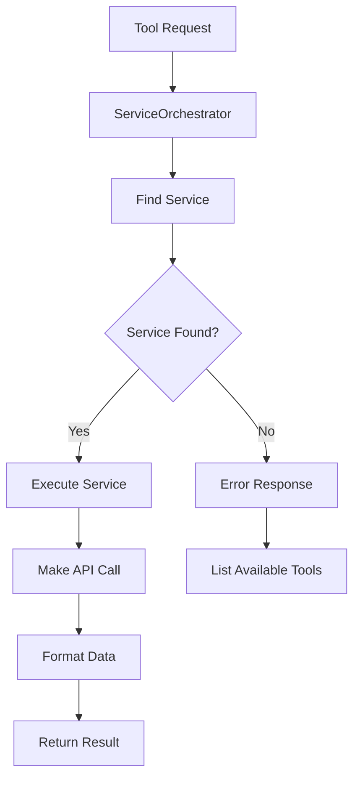
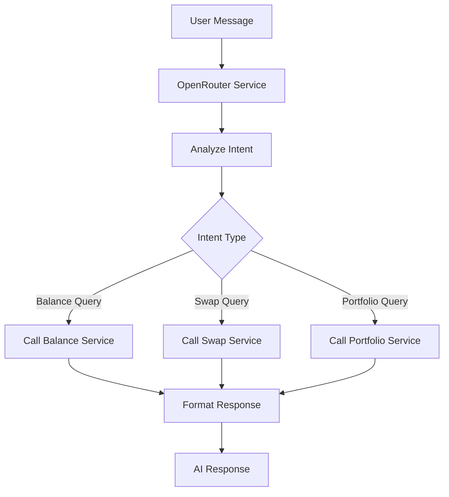

# 1inch MCP Server - Complete Integration Guide

A Model Context Protocol (MCP) server that provides intelligent access to 1inch DEX aggregator APIs with AI-powered chat capabilities.

## 📋 Table of Contents

1. [Architecture Overview](#architecture-overview)
2. [Project Structure](#project-structure)
3. [Setup Instructions](#setup-instructions)
4. [Integration Flow](#integration-flow)
5. [Custom LLM Integration](#custom-llm-integration)
6. [API Reference](#api-reference)
7. [Development Guide](#development-guide)
8. [Troubleshooting](#troubleshooting)

## 🏗️ Architecture Overview

### System Architecture
```
┌─────────────────┐    ┌─────────────────┐    ┌─────────────────┐
│   UI Client     │    │   MCP Server    │    │   1inch APIs    │
│   (Next.js)     │◄──►│   (Node.js)     │◄──►│   (External)    │
└─────────────────┘    └─────────────────┘    └─────────────────┘
         │                       │                       │
         │              ┌─────────────────┐              │
         └──────────────►│  OpenRouter AI  │◄─────────────┘
                        │   (Chat AI)     │
                        └─────────────────┘
```

### Service Architecture
```
ServiceOrchestrator
├── SwapService (Token swapping)
├── TokenService (Token information)
├── BalanceService (Wallet balances)
├── PortfolioService (Portfolio analysis)
├── GasService (Gas prices)
├── ChartsService (Price charts)
├── NFTService (NFT data)
├── DomainService (Domain resolution)
├── OpenRouterService (AI chat)
└── [Other Services...]
```

## 📁 Project Structure

```
1inch-mcp/
├── src/
│   ├── config/                 # Configuration management
│   │   ├── index.ts           # Main config
│   │   ├── logger.ts          # Logging setup
│   │   └── validation.ts      # Environment validation
│   ├── mcp/                   # MCP protocol implementation
│   │   ├── server.ts          # Stdio MCP server
│   │   └── http-server.ts     # HTTP MCP server
│   ├── services/              # Service modules
│   │   ├── base/
│   │   │   └── BaseService.ts # Base service class
│   │   ├── swap/              # Swap functionality
│   │   ├── token/             # Token information
│   │   ├── balance/           # Balance checking
│   │   ├── portfolio/         # Portfolio analysis
│   │   ├── openrouter/        # AI chat integration
│   │   └── [other services]   # Additional services
│   ├── utils/                 # Utility functions
│   │   ├── constants.ts       # Constants
│   │   ├── helpers.ts         # Helper functions
│   │   └── llm/              # LLM utilities
│   ├── index.ts              # Stdio entry point
│   └── http-index.ts         # HTTP entry point
├── tests/                    # Test files
├── cursor/                   # Cursor IDE integration
│   └── mcp.json             # MCP server config
├── ui/                      # Next.js UI application
├── package.json             # Dependencies
├── env.example             # Environment template
└── README.md               # This file
```

## 🚀 Setup Instructions

### Prerequisites
- Node.js 18+ 
- npm or yarn
- 1inch API key
- OpenRouter API key (for AI features)

### Step 1: Install Dependencies
```bash
cd 1inch-mcp
npm install
```

### Step 2: Environment Configuration
```bash
cp env.example .env
```

Configure your `.env` file:
```env
# 1inch API Configuration
ONEINCH_API_KEY=your_1inch_api_key_here
ONEINCH_BASE_URL=https://api.1inch.dev
ONEINCH_TIMEOUT=30000

# OpenRouter Configuration (for AI chat)
OPENROUTER_API_KEY=your_openrouter_api_key_here
OPENROUTER_BASE_URL=https://openrouter.ai/api/v1
OPENROUTER_SMALL_MODEL=gpt-3.5-turbo
OPENROUTER_LARGE_MODEL=gpt-4

# Server Configuration
NODE_ENV=development
MCP_PORT=6969
LOG_LEVEL=info

# Optional: Redis for caching
REDIS_URL=redis://localhost:6379
CACHE_TTL=300
CACHE_ENABLED=true
```

### Step 3: Build the Project
```bash
npm run build
```

### Step 4: Start the Server

#### Option A: HTTP Server (Recommended for UI integration)
```bash
npm run start:http
# Server runs on http://localhost:6969
```

#### Option B: Stdio Server (For MCP clients)
```bash
npm start
# Server runs on stdio for MCP protocol
```

### Step 5: Start the UI (Optional)
```bash
cd ui
npm install
npm run dev
# UI runs on http://localhost:3000
```

## 🔄 Integration Flow

### 1. MCP Server Flow


### 2. HTTP Server Flow


### 3. Service Orchestration Flow


## 🤖 Custom LLM Integration

### 1. OpenRouter Integration (Current)
The server uses OpenRouter for AI chat capabilities:

```typescript
// OpenRouter Service Configuration
const openRouterConfig = {
  baseUrl: 'https://openrouter.ai/api/v1',
  apiKey: process.env.OPENROUTER_API_KEY,
  models: {
    small: 'gpt-3.5-turbo',
    large: 'gpt-4'
  }
};
```

### 2. Custom LLM Integration

#### Option A: Replace OpenRouter with Custom LLM
```typescript
// src/services/custom-llm/CustomLLMService.ts
export class CustomLLMService extends BaseService {
  constructor(config: any) {
    super(config);
  }

  async chatCompletion(message: string, context: any): Promise<any> {
    // Implement your custom LLM logic here
    const response = await this.makeRequest('/chat/completions', {
      method: 'POST',
      data: {
        model: 'your-custom-model',
        messages: [
          { role: 'system', content: 'You are a DeFi assistant.' },
          { role: 'user', content: message }
        ],
        context: context
      }
    });
    
    return response.data;
  }
}
```

#### Option B: Add Custom LLM as Additional Service
```typescript
// In ServiceOrchestrator.ts
this.services.set('custom-llm', new CustomLLMService(customConfig));
```

### 3. LLM Integration Flow


## 📚 API Reference

### MCP Endpoints

#### 1. Tool Calls
```json
{
  "jsonrpc": "2.0",
  "id": 1,
  "method": "tools/call",
  "params": {
    "name": "get_wallet_balances",
    "arguments": {
      "walletAddress": "0x742d35Cc6634C0532925a3b8D4C9db96C4b4d8b6",
      "chainId": 1
    }
  }
}
```

#### 2. Available Tools
- `get_wallet_balances` - Get wallet token balances
- `get_swap_quote` - Get swap quotes
- `get_token_info` - Get token information
- `get_portfolio_overview` - Get portfolio analysis
- `intelligent_chat` - AI-powered chat with tool integration
- `get_gas_price` - Get network gas prices
- `get_chart_data` - Get price chart data
- `get_nft_balances` - Get NFT balances

### HTTP Endpoints

#### 1. Health Check
```bash
GET /health
Response: { "status": "ok", "timestamp": "2024-01-01T00:00:00.000Z" }
```

#### 2. List Tools
```bash
GET /tools
Response: { "tools": [...] }
```

#### 3. Tool Execution
```bash
POST /tools/get_wallet_balances
Body: { "walletAddress": "0x...", "chainId": 1 }
```

### Service-Specific APIs

#### Balance Service
```typescript
// Get wallet balances
await balanceService.getWalletBalances(walletAddress, chainId);

// Get aggregated balances
await balanceService.getAggregatedBalances(walletAddresses, chainId);
```

#### Swap Service
```typescript
// Get swap quote
await swapService.getSwapQuote(fromToken, toToken, amount, chainId);

// Execute swap
await swapService.executeSwap(quote, walletAddress);
```

#### Portfolio Service
```typescript
// Get portfolio overview
await portfolioService.getPortfolioOverview(walletAddress, chainId);

// Get portfolio performance
await portfolioService.getPortfolioPerformance(walletAddress, timeframe);
```

## 🛠️ Development Guide

### Adding New Services

1. **Create Service Directory**
```bash
mkdir src/services/new-service
```

2. **Create Service Class**
```typescript
// src/services/new-service/NewService.ts
import { BaseService, ToolDefinition } from '../base/BaseService';

export class NewService extends BaseService {
  constructor(config: any) {
    super(config);
  }

  getTools(): ToolDefinition[] {
    return [
      {
        name: 'new_tool',
        description: 'Description of new tool',
        inputSchema: {
          type: 'object',
          properties: {
            param1: { type: 'string' }
          }
        }
      }
    ];
  }

  async handleToolCall(name: string, args: any): Promise<any> {
    switch (name) {
      case 'new_tool':
        return await this.newTool(args);
      default:
        throw new Error(`Unknown tool: ${name}`);
    }
  }

  private async newTool(args: any): Promise<any> {
    // Implement tool logic
    return await this.makeRequest('/new-endpoint', {
      method: 'GET',
      params: args
    });
  }
}
```

3. **Register Service**
```typescript
// In ServiceOrchestrator.ts
this.services.set('new-service', new NewService(serviceConfig));
```

### Testing

#### Run All Tests
```bash
npm test
```

#### Run Specific Service Tests
```bash
npm run test:services
```

#### Test Individual Service
```bash
npm test -- --testNamePattern="BalanceService"
```

### Debugging

#### Enable Debug Logging
```env
LOG_LEVEL=debug
```

#### Debug MCP Server
```bash
DEBUG=mcp:* npm run dev
```

#### Debug HTTP Server
```bash
DEBUG=express:* npm run dev:http
```

## 🔧 Configuration

### Environment Variables

| Variable | Description | Default |
|----------|-------------|---------|
| `ONEINCH_API_KEY` | 1inch API key | Required |
| `OPENROUTER_API_KEY` | OpenRouter API key | Required |
| `MCP_PORT` | HTTP server port | 6969 |
| `NODE_ENV` | Environment | development |
| `LOG_LEVEL` | Logging level | info |
| `CACHE_ENABLED` | Enable caching | false |
| `REDIS_URL` | Redis URL | redis://localhost:6379 |

### Service Configuration

#### 1inch API Configuration
```typescript
const oneInchConfig = {
  baseUrl: 'https://api.1inch.dev',
  apiKey: process.env.ONEINCH_API_KEY,
  timeout: 30000
};
```

#### OpenRouter Configuration
```typescript
const openRouterConfig = {
  baseUrl: 'https://openrouter.ai/api/v1',
  apiKey: process.env.OPENROUTER_API_KEY,
  models: {
    small: 'gpt-3.5-turbo',
    large: 'gpt-4'
  },
  maxTokens: 4096,
  temperature: 0.7
};
```

## 🚨 Troubleshooting

### Common Issues

#### 1. API Key Errors
```bash
Error: Invalid API key
Solution: Verify ONEINCH_API_KEY and OPENROUTER_API_KEY in .env
```

#### 2. Port Already in Use
```bash
Error: EADDRINUSE
Solution: Change MCP_PORT in .env or kill existing process
```

#### 3. Build Errors
```bash
Error: TypeScript compilation failed
Solution: Run `npm run build` to check for type errors
```

#### 4. Service Connection Issues
```bash
Error: Service not responding
Solution: Check network connectivity and API endpoints
```

### Debug Commands

#### Check Service Health
```bash
curl http://localhost:6969/health
```

#### Test Tool Execution
```bash
curl -X POST http://localhost:6969/tools/get_wallet_balances \
  -H "Content-Type: application/json" \
  -d '{"walletAddress":"0x742d35Cc6634C0532925a3b8D4C9db96C4b4d8b6","chainId":1}'
```

#### View Available Tools
```bash
curl http://localhost:6969/tools
```

### Performance Optimization

#### 1. Enable Caching
```env
CACHE_ENABLED=true
REDIS_URL=redis://localhost:6379
CACHE_TTL=300
```

#### 2. Rate Limiting
```env
RATE_LIMIT_WINDOW_MS=900000
RATE_LIMIT_MAX_REQUESTS=100
```

#### 3. Load Balancing
For production, use multiple server instances behind a load balancer.

## 📈 Monitoring

### Health Checks
- `/health` - Basic health status
- Service-specific health checks
- API endpoint availability

### Logging
- Request/response logging
- Error tracking
- Performance metrics

### Metrics
- Request count
- Response times
- Error rates
- API usage

## 🔗 Integration Examples

### 1. Cursor IDE Integration
```json
// cursor/mcp.json
{
  "mcpServers": {
    "1inch-mcp-server": {
      "command": "node",
      "args": ["/path/to/1inch-mcp/dist/index.js"],
      "env": {
        "ONEINCH_API_KEY": "your_api_key_here"
      }
    }
  }
}
```

### 2. Custom Client Integration
```typescript
// Example client integration
import { Client } from '@modelcontextprotocol/sdk/client/index.js';
import { StdioClientTransport } from '@modelcontextprotocol/sdk/client/stdio.js';

const client = new Client({
  name: '1inch-client',
  version: '1.0.0'
}, {
  capabilities: {
    tools: {},
    resources: {},
    prompts: {}
  }
});

const transport = new StdioClientTransport({
  command: 'node',
  args: ['/path/to/1inch-mcp/dist/index.js']
});

await client.connect(transport);
```

### 3. Web Application Integration
```typescript
// Example web app integration
class MCPClient {
  async callTool(name: string, args: any) {
    const response = await fetch('http://localhost:6969/mcp', {
      method: 'POST',
      headers: { 'Content-Type': 'application/json' },
      body: JSON.stringify({
        jsonrpc: '2.0',
        id: 1,
        method: 'tools/call',
        params: { name, arguments: args }
      })
    });
    
    return response.json();
  }
}
```

## 📄 License

MIT License - see LICENSE file for details.

## 🤝 Contributing

1. Fork the repository
2. Create a feature branch
3. Make your changes
4. Add tests for new functionality
5. Submit a pull request

## 📞 Support

For issues and questions:
- Create an issue on GitHub
- Check the documentation
- Review the test examples
- Contact the development team

---

**Built with ❤️ using Node.js, TypeScript, and the Model Context Protocol** 