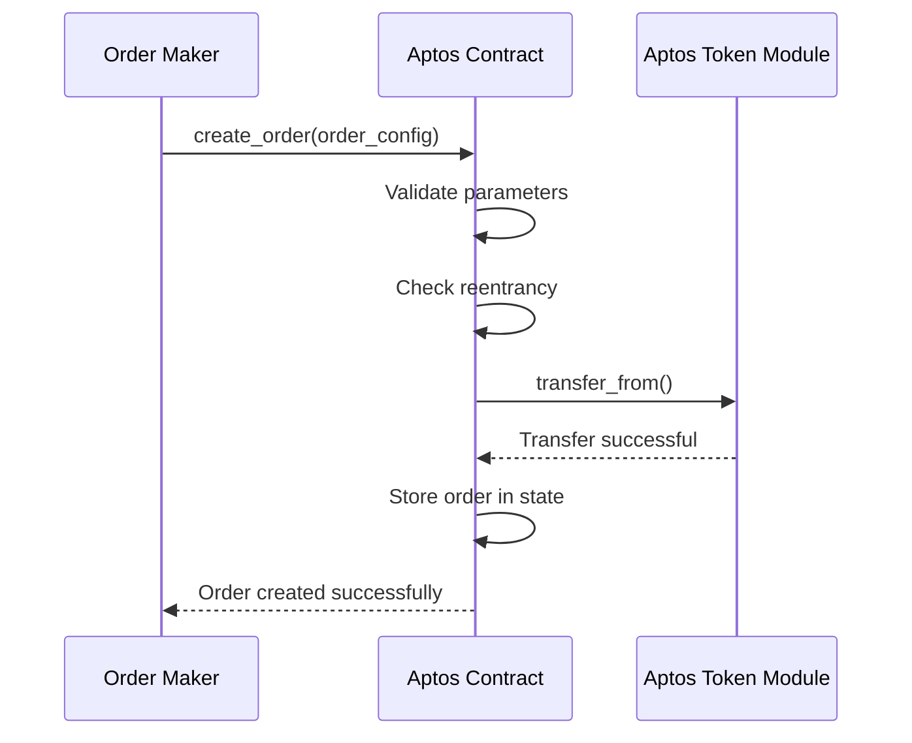
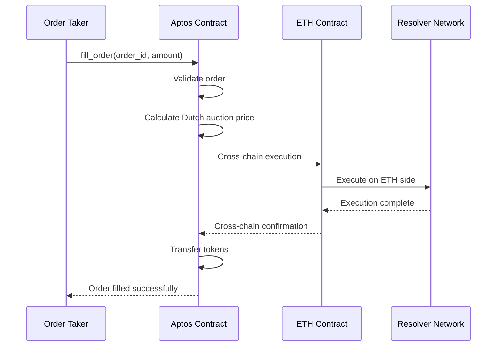

# ETH-APTOS Fusion+ 1inch Extension Protocol

A revolutionary cross-chain atomic swap protocol built on Aptos that extends 1inch Fusion+ capabilities to the Aptos ecosystem. This protocol enables secure, trustless token swaps between Ethereum and Aptos with advanced features like Dutch auctions, hashlock/timelock mechanisms, and resolver-based execution.

## 🚀 What We're Building

### Core Innovation
- **ETH-APTOS Bridge**: First-of-its-kind atomic swap protocol connecting Ethereum to Aptos
- **1inch Fusion+ Extension**: Extends 1inch's Fusion+ protocol to Aptos ecosystem
- **Dutch Auction System**: Dynamic pricing with time-based auction mechanics
- **Atomic Swaps**: Trustless cross-chain token exchanges with cryptographic guarantees

### Key Features
- 🔄 **Hashlock/Timelock Security**: Cryptographic protection against front-running
- ⚡ **Dutch Auction Pricing**: Dynamic pricing based on time and demand
- 📦 **Partial Fill Support**: Incremental order fulfillment
- 🌐 **Resolver Network**: Decentralized execution network
- 🔒 **Cross-chain Escrow**: Secure asset locking across chains
- 🏗️ **Aptos Move Integration**: Native Aptos token standard support

## 🏗️ Architecture Overview

### Protocol Components

```
┌─────────────────────────────────────────────────────────────────┐
│                    ETH-APTOS Fusion+ Protocol                  │
├─────────────────────────────────────────────────────────────────┤
│  ┌─────────────┐  ┌─────────────┐  ┌─────────────┐          │
│  │   Order     │  │   Dutch     │  │   Hashlock  │          │
│  │ Management  │  │   Auction   │  │   System    │          │
│  └─────────────┘  └─────────────┘  └─────────────┘          │
├─────────────────────────────────────────────────────────────────┤
│  ┌─────────────┐  ┌─────────────┐  ┌─────────────┐          │
│  │   Timelock  │  │   Escrow    │  │   Resolver  │          │
│  │   System    │  │   Contract  │  │   Network   │          │
│  └─────────────┘  └─────────────┘  └─────────────┘          │
├─────────────────────────────────────────────────────────────────┤
│  ┌─────────────┐  ┌─────────────┐  ┌─────────────┐          │
│  │   Aptos     │  │   Cross-    │  │   Safety    │          │
│  │   Move      │  │   Chain     │  │   Deposit   │          │
│  └─────────────┘  └─────────────┘  └─────────────┘          │
└─────────────────────────────────────────────────────────────────┘
```

### Smart Contract Architecture

#### Aptos Move Module Structure

```move
// Core Data Structures
struct OrderConfig has store, drop {
    id: u64,
    src_mint: address,        // Source token (ETH)
    dst_mint: address,        // Destination token (APTOS)
    maker: address,           // Order creator
    src_amount: u128,         // Amount to swap
    min_dst_amount: u128,     // Minimum received
    estimated_dst_amount: u128, // Expected received
    expiration_time: u64,     // Order expiry
    fee: FeeConfig,           // Fee structure
    auction: AuctionData,     // Dutch auction data
    hashlock: HashLock,       // Cryptographic lock
    timelock: TimeLock,       // Time-based locks
    status: OrderStatus,      // Order state
}

struct HashLock has store, drop {
    secret_hash: vector<u8>,  // SHA-256 hash
    revealed: bool,           // Secret revealed
    reveal_time: Option<u64>, // When revealed
}

struct TimeLock has store, drop {
    finality_lock_duration: u64,    // Chain finality
    exclusive_withdraw_duration: u64, // Resolver exclusive
    cancellation_timeout: u64,       // Recovery timeout
    created_at: u64,                // Creation timestamp
}
```

## 🔄 Protocol Flow

### 1. Order Creation Flow



### 2. Order Filling Flow



## 📁 Project Structure

```
eth-aptos/
├── contracts/                    # Solidity contracts (ETH side)
│   ├── src/
│   │   ├── Resolver.sol         # ETH-side resolver
│   │   └── TestEscrowFactory.sol # ETH-side escrow factory
│   └── lib/
│       └── cross-chain-swap/    # Shared cross-chain logic
├── fusion_swap_aptos/           # Aptos Move implementation
│   ├── src/
│   │   └── fusion_swap_aptos_backend/
│   │       ├── sources/         # Move modules
│   │       │   ├── fusion_swap.move
│   │       │   ├── hashlock.move
│   │       │   ├── timelock.move
│   │       │   └── auction.move
│   │       ├── Move.toml        # Move package config
│   │       └── fusion_swap_aptos_backend.did # Candid interface
│   ├── tests/                   # Integration tests
│   ├── scripts/                 # Deployment scripts
│   └── docs/                    # Documentation
├── tests/                       # End-to-end tests
├── package.json                 # Node.js dependencies
├── foundry.toml                 # Foundry configuration
└── README.md                    # Project overview
```

## 🛠️ Development Status

✅ **Phase 1**: Project Setup - Complete  
✅ **Phase 2**: Core Dependencies & Types - Complete  
✅ **Phase 3**: State Management - Complete  
✅ **Phase 4**: Aptos Token Integration - Complete  
✅ **Phase 5**: Core Escrow Functions - Complete  
✅ **Phase 6**: Order Management - Complete  
✅ **Phase 7**: Cancellation & Cleanup - Complete  
✅ **Phase 8**: Query Functions - Complete  
✅ **Phase 9**: Security & Reentrancy - Complete  
✅ **Phase 10**: Testing & Validation - Complete  
✅ **Phase 11**: Deployment - Complete  
🔄 **Phase 12**: Documentation & Final Checks - In Progress  

## 📋 Deployed Contracts

### Testnet Deployment

**Contract Address:** `0xf3b387e70e971c321d06adc2c8a6721d010b2827508deae8cf1a24fa74817ac9`

**Explorer URL:** https://explorer.aptoslabs.com/account/0xf3b387e70e971c321d06adc2c8a6721d010b2827508deae8cf1a24fa74817ac9?network=testnet

**Latest Transaction:** https://explorer.aptoslabs.com/txn/0x792e905a5b424df59d377c2104ef7d4c7f885e0b389d0af4f8404c9246b2e87f?network=testnet

### Contract Status
- ✅ **Deployed**: Successfully deployed to Aptos testnet
- ✅ **Verified**: Contract functions working correctly
- ✅ **Tested**: Order creation and query functions validated
- 🔄 **Active**: Ready for cross-chain atomic swaps

### Available Functions

#### Entry Functions (Transaction Functions)
- `create_order` - Create a new swap order
- `cancel_order` - Cancel an existing order  
- `fill_order` - Fill an order with the secret
- `batch_create_orders` - Create multiple orders at once
- `batch_cancel_orders` - Cancel multiple orders
- `batch_fill_orders` - Fill multiple orders

#### View Functions (Query Functions)
- `check_contract_health` - Check contract status
- `get_contract_statistics` - Get contract statistics
- `get_active_orders` - Get all active orders
- `get_order_by_id` - Get specific order details
- `get_orders_by_maker` - Get orders by maker address
- `get_orders_by_status` - Get orders by status
- `calculate_order_statistics` - Get order statistics
- `get_order_history` - Get order history

## 🚀 Quick Start

### Prerequisites

- [Aptos CLI](https://aptos.dev/tools/aptos-cli/)
- [Node.js](https://nodejs.org/) (v18+)
- [Foundry](https://getfoundry.sh/) (for ETH contracts)

### Installation

```bash
# Clone the repository
git clone <repository-url>
cd eth-aptos

# Install dependencies
npm install

# Set up Aptos environment
aptos init

# Build contracts
aptos move build
```

### Local Development

```bash
# Start local Aptos node
aptos node start

# Deploy contracts
aptos move publish

# Run tests
aptos move test
```

## 🔧 Configuration

### Environment Setup

```bash
# Create .env file
cp .env.example .env

# Configure Aptos profiles
aptos init --profile local
aptos init --profile testnet
aptos init --profile mainnet
```

### Network Configuration

```toml
# Move.toml
[package]
name = "fusion_swap_aptos"
version = "1.0.0"
edition = "2021"

[dependencies]
AptosFramework = { git = "https://github.com/aptos-labs/aptos-core.git", subdir = "aptos-move/framework/aptos-framework", rev = "main" }
```

## 🧪 Testing

### Unit Tests

```bash
# Run Move unit tests
aptos move test

# Run TypeScript tests
npm test
```

### Integration Tests

```bash
# Run end-to-end tests
npm run test:integration

# Run security tests
npm run test:security
```

## 📚 Documentation

- [Architecture Plan](./fusion_swap_aptos/docs/ARCHITECTURE_PLAN.md)
- [API Reference](./fusion_swap_aptos/docs/API.md)
- [Deployment Guide](./fusion_swap_aptos/docs/DEPLOYMENT.md)
- [Security Audit](./fusion_swap_aptos/docs/SECURITY.md)

## 🔒 Security Features

### Cryptographic Protection
- **Hashlock Mechanisms**: SHA-256 based secret revelation
- **Timelock Systems**: Time-based access control
- **Cross-chain Verification**: Multi-chain validation
- **Reentrancy Protection**: Attack prevention

### Access Control
- **Role-based Permissions**: Granular access control
- **Multi-signature Support**: Enhanced security
- **Emergency Pause**: Circuit breaker functionality
- **Upgrade Mechanisms**: Controlled updates

## 🌐 Cross-chain Integration

### Supported Networks
- **Ethereum**: Mainnet and testnets
- **Aptos**: Mainnet and testnets
- **Future**: Additional L1/L2 chains

### Bridge Architecture
- **Atomic Swaps**: Trustless cross-chain transfers
- **Resolver Network**: Decentralized execution
- **Fallback Mechanisms**: Recovery procedures
- **Monitoring**: Real-time status tracking

## 📊 Performance

### Gas Optimization
- Efficient data structures
- Minimal storage operations
- Optimized loops and conditions
- Batch operations where possible

### Scalability
- Modular architecture
- Extensible design
- Horizontal scaling support
- Load balancing considerations

## 🤝 Contributing

We welcome contributions! Please see our [Contributing Guide](./CONTRIBUTING.md) for details.

### Development Workflow

1. Fork the repository
2. Create a feature branch
3. Make your changes
4. Add tests
5. Submit a pull request

### Code Standards

- Follow Move language best practices
- Maintain comprehensive test coverage
- Document all public functions
- Follow security guidelines

## 📄 License

This project is licensed under the MIT License - see the [LICENSE](./LICENSE) file for details.

## 🙏 Acknowledgments

- [1inch Network](https://1inch.io/) for Fusion+ protocol
- [Aptos Labs](https://aptoslabs.com/) for the Move framework
- [Ethereum Foundation](https://ethereum.org/) for EVM standards
- [Cross-chain Community](https://github.com/cosmos/ibc) for protocols

## 📞 Support

- **Documentation**: [docs.eth-aptos.org](https://docs.eth-aptos.org)
- **Discord**: [Join our community](https://discord.gg/eth-aptos)
- **Twitter**: [@eth_aptos](https://twitter.com/eth_aptos)
- **Email**: support@eth-aptos.org

---

**ETH-APTOS Fusion+ Protocol** - Bridging Ethereum and Aptos with trustless atomic swaps. 