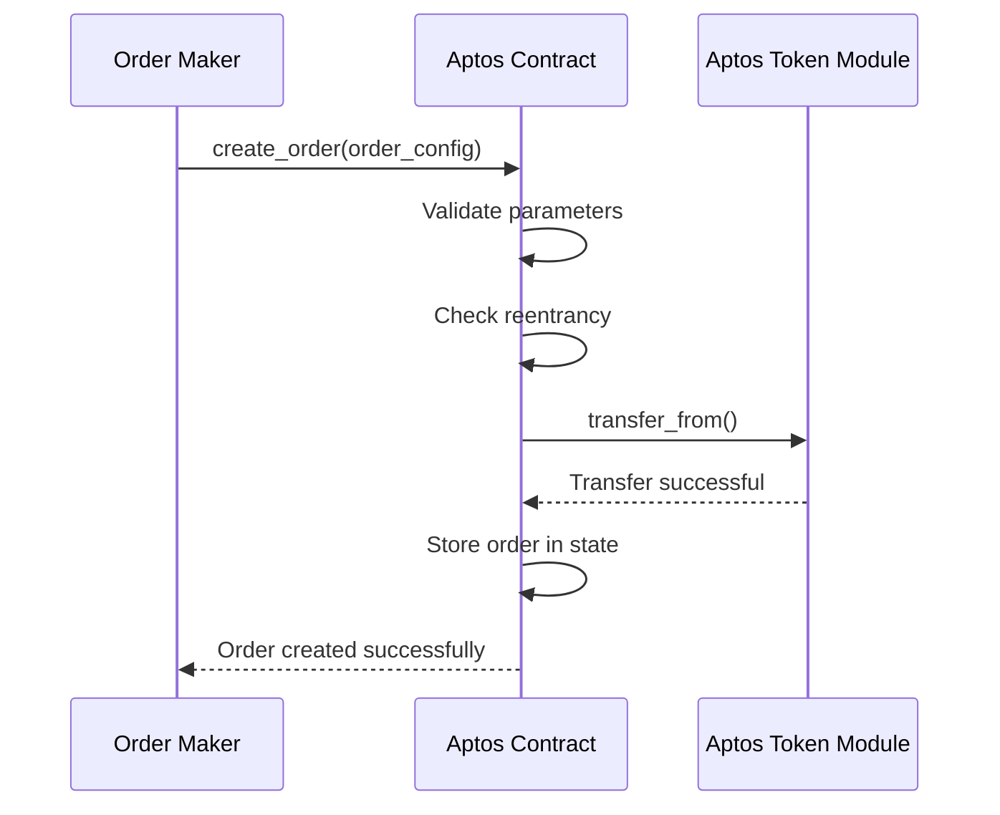
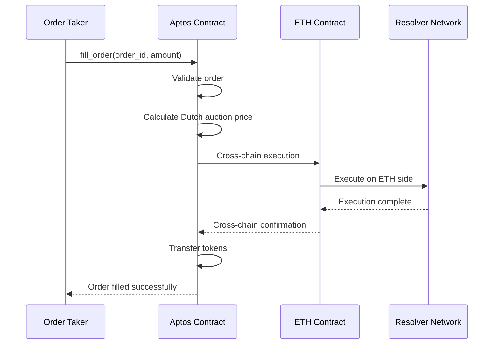

# ETH-APTOS Fusion Swap Architecture Plan

## Overview

This document outlines the architecture and implementation plan for the ETH-APTOS Fusion Swap protocol, extending the 1inch Fusion+ capabilities to the Aptos blockchain ecosystem.

## 🎯 Project Goals

### Primary Objectives
- **Cross-chain Atomic Swaps**: Enable trustless token swaps between Ethereum and Aptos
- **1inch Fusion+ Extension**: Extend Fusion+ protocol to Aptos ecosystem
- **Dutch Auction System**: Implement dynamic pricing with time-based auction mechanics
- **Security First**: Hashlock/timelock mechanisms for cryptographic protection

### Key Features
- ✅ **Hashlock/Timelock Security**: Cryptographic protection against front-running
- ✅ **Dutch Auction Pricing**: Dynamic pricing based on time and demand
- ✅ **Partial Fill Support**: Incremental order fulfillment
- ✅ **Resolver Network**: Decentralized execution network
- ✅ **Cross-chain Escrow**: Secure asset locking across chains
- ✅ **Aptos Move Integration**: Native Aptos token standard support

## 🏗️ Architecture Overview

### Protocol Components

```
┌─────────────────────────────────────────────────────────────────┐
│                    ETH-APTOS Fusion+ Protocol                  │
├─────────────────────────────────────────────────────────────────┤
│  ┌─────────────┐  ┌─────────────┐  ┌─────────────┐          │
│  │   Order     │  │   Dutch     │  │   Hashlock  │          │
│  │ Management  │  │   Auction   │  │   System    │          │
│  └─────────────┘  └─────────────┘  └─────────────┘          │
├─────────────────────────────────────────────────────────────────┤
│  ┌─────────────┐  ┌─────────────┐  ┌─────────────┐          │
│  │   Timelock  │  │   Escrow    │  │   Resolver  │          │
│  │   System    │  │   Contract  │  │   Network   │          │
│  └─────────────┘  └─────────────┘  └─────────────┘          │
├─────────────────────────────────────────────────────────────────┤
│  ┌─────────────┐  ┌─────────────┐  ┌─────────────┐          │
│  │   Aptos     │  │   Cross-    │  │   Safety    │          │
│  │   Move      │  │   Chain     │  │   Deposit   │          │
│  └─────────────┘  └─────────────┘  └─────────────┘          │
└─────────────────────────────────────────────────────────────────┘
```

### Smart Contract Architecture

#### Aptos Move Module Structure

```move
// Core Data Structures
struct OrderConfig has store, drop {
    id: u64,
    src_mint: address,        // Source token (ETH)
    dst_mint: address,        // Destination token (APTOS)
    maker: address,           // Order creator
    src_amount: u128,         // Amount to swap
    min_dst_amount: u128,     // Minimum received
    estimated_dst_amount: u128, // Expected received
    expiration_time: u64,     // Order expiry
    fee: FeeConfig,           // Fee structure
    auction: AuctionData,     // Dutch auction data
    hashlock: HashLock,       // Cryptographic lock
    timelock: TimeLock,       // Time-based locks
    status: OrderStatus,      // Order state
}

struct HashLock has store, drop {
    secret_hash: vector<u8>,  // SHA-256 hash
    revealed: bool,           // Secret revealed
    reveal_time: Option<u64>, // When revealed
}

struct TimeLock has store, drop {
    finality_lock_duration: u64,    // Chain finality
    exclusive_withdraw_duration: u64, // Resolver exclusive
    cancellation_timeout: u64,       // Recovery timeout
    created_at: u64,                // Creation timestamp
}
```

## 🔄 Protocol Flow

### 1. Order Creation Flow



### 2. Order Filling Flow



## 📁 Project Structure

```
eth-aptos/
├── contracts/                    # Solidity contracts (ETH side)
│   ├── src/
│   │   ├── Resolver.sol         # ETH-side resolver
│   │   └── TestEscrowFactory.sol # ETH-side escrow factory
│   └── lib/
│       └── cross-chain-swap/    # Shared cross-chain logic
├── fusion_swap_aptos/           # Aptos Move implementation
│   ├── src/
│   │   └── fusion_swap_aptos_backend/
│   │       ├── sources/         # Move modules
│   │       │   ├── fusion_swap.move
│   │       │   ├── hashlock.move
│   │       │   ├── timelock.move
│   │       │   └── auction.move
│   │       ├── Move.toml        # Move package config
│   │       └── fusion_swap_aptos_backend.did # Candid interface
│   ├── tests/                   # Integration tests
│   ├── scripts/                 # Deployment scripts
│   └── docs/                    # Documentation
├── tests/                       # End-to-end tests
├── package.json                 # Node.js dependencies
├── foundry.toml                 # Foundry configuration
└── README.md                    # Project overview
```

## 🛠️ Implementation Phases

### Phase 1: Project Setup ✅
- [x] Create directory structure
- [x] Initialize Move package
- [x] Set up development environment
- [ ] Configure Aptos CLI
- [ ] Set up testing framework

### Phase 2: Core Dependencies & Types
- [ ] Define core data structures
- [ ] Implement error handling
- [ ] Set up Move module dependencies
- [ ] Create type definitions

### Phase 3: State Management
- [ ] Implement order storage
- [ ] Create state management utilities
- [ ] Set up reentrancy protection
- [ ] Implement access control

### Phase 4: Aptos Token Integration
- [ ] Integrate with Aptos token standard
- [ ] Implement transfer functions
- [ ] Add approval mechanisms
- [ ] Handle token metadata

### Phase 5: Core Escrow Functions
- [ ] Implement order creation
- [ ] Add order validation
- [ ] Create escrow mechanisms
- [ ] Implement refund logic

### Phase 6: Order Management
- [ ] Add order querying
- [ ] Implement order updates
- [ ] Create order filtering
- [ ] Add order statistics

### Phase 7: Cancellation & Cleanup
- [ ] Implement order cancellation
- [ ] Add cleanup functions
- [ ] Handle expired orders
- [ ] Implement refund mechanisms

### Phase 8: Query Functions
- [ ] Add order retrieval
- [ ] Implement filtering
- [ ] Create statistics functions
- [ ] Add debugging utilities

### Phase 9: Security & Reentrancy
- [ ] Implement security checks
- [ ] Add reentrancy protection
- [ ] Create access control
- [ ] Add validation functions

### Phase 10: Testing & Validation
- [ ] Unit tests for all functions
- [ ] Integration tests
- [ ] Security tests
- [ ] Performance tests

### Phase 11: Deployment
- [ ] Local deployment setup
- [ ] Testnet deployment
- [ ] Mainnet deployment
- [ ] Monitoring setup

### Phase 12: Documentation & Final Checks
- [ ] Complete documentation
- [ ] Code review
- [ ] Security audit
- [ ] Performance optimization

## 🔧 Technical Specifications

### Aptos Move Module Requirements

```toml
[package]
name = "fusion_swap_aptos"
version = "1.0.0"
edition = "2021"

[dependencies]
AptosFramework = { git = "https://github.com/aptos-labs/aptos-core.git", subdir = "aptos-move/framework/aptos-framework", rev = "main" }
```

### Key Dependencies
- **AptosFramework**: Core Aptos framework
- **Move Standard Library**: Standard Move libraries
- **SHA-256**: Cryptographic hashing
- **Time**: Time-based operations

### Security Considerations
- **Reentrancy Protection**: Prevent reentrancy attacks
- **Access Control**: Proper authorization checks
- **Input Validation**: Comprehensive parameter validation
- **Error Handling**: Robust error management
- **Resource Management**: Proper resource cleanup

## 🚀 Deployment Strategy

### Local Development
```bash
# Start local Aptos node
aptos node start

# Deploy contracts
aptos move publish

# Test functions
aptos move test
```

### Testnet Deployment
```bash
# Deploy to testnet
aptos move publish --profile testnet

# Initialize contracts
aptos move run --profile testnet
```

### Mainnet Deployment
```bash
# Deploy to mainnet
aptos move publish --profile mainnet

# Initialize contracts
aptos move run --profile mainnet
```

## 📊 Performance Considerations

### Gas Optimization
- Efficient data structures
- Minimal storage operations
- Optimized loops and conditions
- Batch operations where possible

### Scalability
- Modular architecture
- Extensible design
- Horizontal scaling support
- Load balancing considerations

## 🔍 Monitoring & Analytics

### Key Metrics
- Order creation rate
- Fill success rate
- Average fill time
- Gas usage patterns
- Error rates

### Monitoring Tools
- Aptos Explorer integration
- Custom analytics dashboard
- Real-time alerts
- Performance tracking

## 🛡️ Security Features

### Cryptographic Protection
- Hashlock mechanisms
- Timelock systems
- Secret revelation protocols
- Cross-chain verification

### Access Control
- Role-based permissions
- Multi-signature support
- Emergency pause functionality
- Upgrade mechanisms

## 🔮 Future Enhancements

### Planned Features
1. **Stable Memory**: Persistent storage optimization
2. **Price Oracles**: External price feed integration
3. **Advanced Auctions**: More sophisticated auction types
4. **Cross-chain Bridges**: Additional chain support
5. **DAO Governance**: Decentralized governance

### Research Areas
- Zero-knowledge proofs
- Advanced cryptographic primitives
- Cross-chain communication protocols
- Scalability solutions

## 📚 References

### Documentation
- [Aptos Move Book](https://move-book.aptoslabs.com/)
- [Aptos Framework](https://github.com/aptos-labs/aptos-core)
- [1inch Fusion+ Documentation](https://docs.1inch.io/)
- [Cross-chain Protocols](https://docs.axelar.dev/)

### Standards
- [Aptos Token Standard](https://github.com/aptos-labs/aptos-core/blob/main/aptos-move/framework/aptos-token/sources/token.move)
- [Move Language](https://move-language.github.io/move/)
- [Cross-chain Standards](https://github.com/cosmos/ibc)

---

This architecture plan provides a comprehensive roadmap for implementing the ETH-APTOS Fusion Swap protocol, extending the successful ETH-ICP implementation to the Aptos ecosystem. 