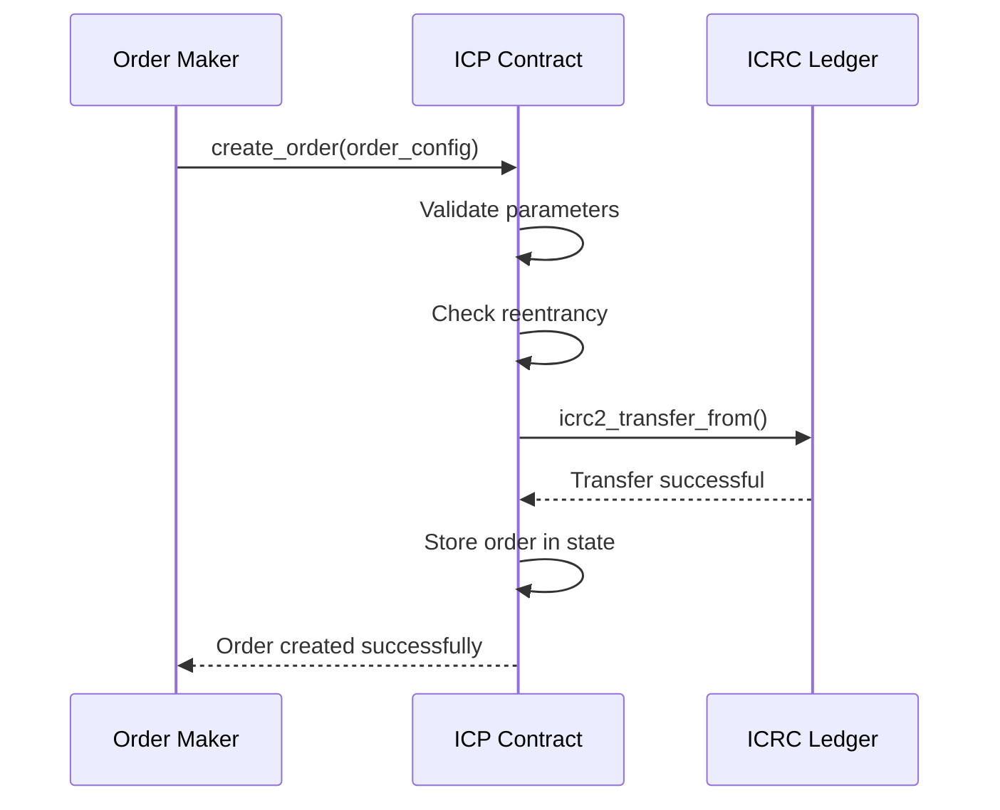
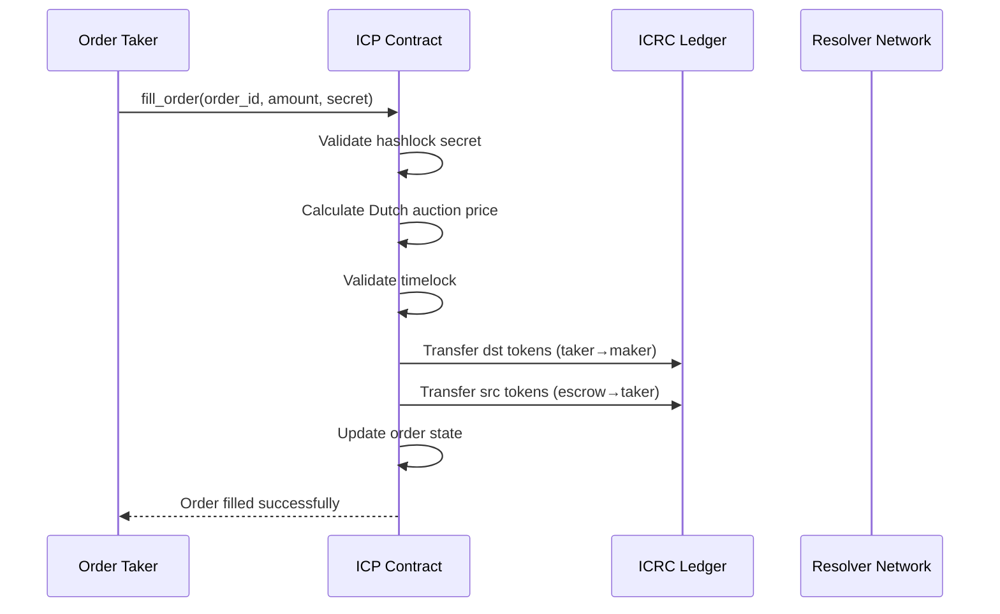
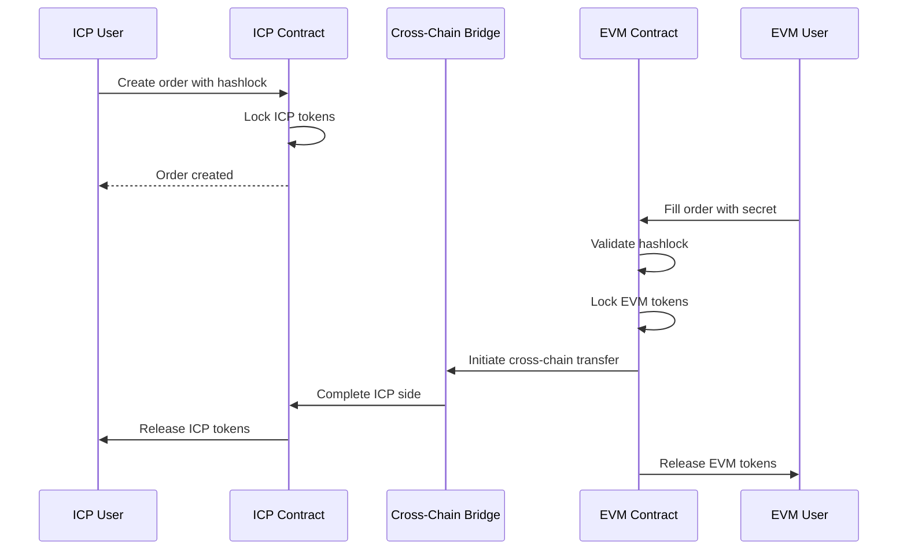

# ICP Fusion+ 1inch Extension Protocol

A revolutionary cross-chain atomic swap protocol built on the Internet Computer (ICP) that extends 1inch Fusion+ capabilities to the ICP ecosystem. This protocol enables secure, trustless token swaps between ICP and EVM chains with advanced features like Dutch auctions, hashlock/timelock mechanisms, and resolver-based execution.

## 🚀 What We've Built

### Core Innovation
- **ICP-EVM Bridge**: First-of-its-kind atomic swap protocol connecting Internet Computer to Ethereum/BSC
- **1inch Fusion+ Extension**: Extends 1inch's Fusion+ protocol to ICP ecosystem
- **Dutch Auction System**: Dynamic pricing with time-based auction mechanics
- **Atomic Swaps**: Trustless cross-chain token exchanges with cryptographic guarantees

### Key Features
- ✅ **Hashlock/Timelock Security**: Cryptographic protection against front-running
- ✅ **Dutch Auction Pricing**: Dynamic pricing based on time and demand
- ✅ **Partial Fill Support**: Incremental order fulfillment
- ✅ **Resolver Network**: Decentralized execution network
- ✅ **Cross-chain Escrow**: Secure asset locking across chains
- ✅ **ICRC-2 Integration**: Native ICP token standard support

## 🏗️ Architecture Overview

### Protocol Components

```
┌─────────────────────────────────────────────────────────────────┐
│                    ICP Fusion+ Protocol                        │
├─────────────────────────────────────────────────────────────────┤
│  ┌─────────────┐  ┌─────────────┐  ┌─────────────┐          │
│  │   Order     │  │   Dutch     │  │   Hashlock  │          │
│  │ Management  │  │   Auction   │  │   System    │          │
│  └─────────────┘  └─────────────┘  └─────────────┘          │
├─────────────────────────────────────────────────────────────────┤
│  ┌─────────────┐  ┌─────────────┐  ┌─────────────┐          │
│  │   Timelock  │  │   Escrow    │  │   Resolver  │          │
│  │   System    │  │   Contract  │  │   Network   │          │
│  └─────────────┘  └─────────────┘  └─────────────┘          │
├─────────────────────────────────────────────────────────────────┤
│  ┌─────────────┐  ┌─────────────┐  ┌─────────────┐          │
│  │   ICRC-2    │  │   Cross-    │  │   Safety    │          │
│  │   Tokens    │  │   Chain     │  │   Deposit   │          │
│  └─────────────┘  └─────────────┘  └─────────────┘          │
└─────────────────────────────────────────────────────────────────┘
```

### Smart Contract Architecture

```rust
// Core Data Structures
#[derive(CandidType, Deserialize, Clone)]
pub struct OrderConfig {
    pub id: u64,
    pub src_mint: Principal,        // Source token (ICP)
    pub dst_mint: Principal,        // Destination token (EVM)
    pub maker: Principal,           // Order creator
    pub src_amount: Amount,         // Amount to swap
    pub min_dst_amount: Amount,     // Minimum received
    pub estimated_dst_amount: Amount, // Expected received
    pub expiration_time: u64,       // Order expiry
    pub fee: FeeConfig,             // Fee structure
    pub auction: AuctionData,       // Dutch auction data
    pub hashlock: HashLock,         // Cryptographic lock
    pub timelock: TimeLock,         // Time-based locks
    pub status: OrderStatus,        // Order state
}

#[derive(CandidType, Deserialize, Clone)]
pub struct HashLock {
    pub secret_hash: [u8; 32],     // SHA-256 hash
    pub revealed: bool,             // Secret revealed
    pub reveal_time: Option<u64>,   // When revealed
}

#[derive(CandidType, Deserialize, Clone)]
pub struct TimeLock {
    pub finality_lock_duration: u64,    // Chain finality
    pub exclusive_withdraw_duration: u64, // Resolver exclusive
    pub cancellation_timeout: u64,       // Recovery timeout
    pub created_at: u64,                // Creation timestamp
}
```

## 🔄 Protocol Flow

### 1. Order Creation Flow



### 2. Order Filling Flow



### 3. Cross-Chain Atomic Swap Flow



## 🛠️ Setup & Installation

### Prerequisites

```bash
# Install DFX (Internet Computer SDK)
sh -ci "$(curl -fsSL https://internetcomputer.org/install.sh)"

# Install Foundry (for EVM contracts)
curl -L https://foundry.paradigm.xyz | bash

# Install Node.js dependencies
npm install -g pnpm
```

### Local Development Setup

```bash
# Clone the repository
git clone <repository-url>
cd eth-icp

# Install dependencies
pnpm install

# Start local Internet Computer replica
dfx start --background

# Deploy the canister
dfx deploy --network local

# Run tests
pnpm test
```

### Environment Configuration

Create a `.env` file:

```bash
# ICP Configuration
ICP_NETWORK=local
ICP_CANISTER_ID=br5f7-7uaaa-aaaaa-qaaca-cai

# EVM Configuration
ETH_FORK_URL=https://eth.merkle.io
BSC_FORK_URL=wss://bsc-rpc.publicnode.com

# Test Accounts
MAKER_PRINCIPAL=your_maker_principal
TAKER_PRINCIPAL=your_taker_principal
RESOLVER_PRINCIPAL=your_resolver_principal
```

## 📊 Dutch Auction Mechanism

### Price Calculation

The protocol implements a sophisticated Dutch auction system:

```rust
// Dutch auction price calculation
let current_time = ic_cdk::api::time() / 1_000_000_000;
let dst_amount = if current_time >= order.auction.start_time && 
                    current_time <= order.auction.end_time {
    // Linear interpolation for price
    let total_duration = order.auction.end_time - order.auction.start_time;
    let current_price = (order.auction.start_price * (order.auction.end_time - current_time) as u128 + 
                        order.auction.end_price * (current_time - order.auction.start_time) as u128) / 
                        total_duration as u128;
    
    // Calculate dst amount based on current price
    (taker_amount * current_price) / order.auction.start_price
} else {
    // Use estimated amount if outside auction window
    (taker_amount * order.estimated_dst_amount) / order.src_amount
};
```

### Auction Parameters

```rust
#[derive(CandidType, Deserialize, Clone)]
pub struct AuctionData {
    pub start_time: u64,        // Auction start timestamp
    pub end_time: u64,          // Auction end timestamp
    pub start_price: Amount,     // Starting price (highest)
    pub end_price: Amount,       // Ending price (lowest)
    pub current_price: Amount,   // Current calculated price
}
```

## 🔐 Security Features

### Hashlock System
- **Secret Generation**: 32-byte random secret
- **Hash Storage**: SHA-256 hash of secret
- **Preimage Validation**: Secret verification on fill
- **Merkle Tree Support**: For partial fills

### Timelock System
- **Finality Protection**: Chain reorganization protection
- **Exclusive Periods**: Resolver-only withdrawal windows
- **Cancellation Timeout**: Recovery mechanisms
- **Cross-chain Coordination**: Synchronized timelocks

### Reentrancy Protection
```rust
thread_local! {
    static REENTRANCY_GUARD: RefCell<bool> = RefCell::new(false);
}

// Usage in functions
REENTRANCY_GUARD.with(|guard| {
    if *guard.borrow() {
        return Err(FusionError::ReentrancyDetected);
    }
    *guard.borrow_mut() = true;
    Ok(())
})?;
```

## 🧪 Testing

### Running Tests

```bash
# Run all tests
pnpm test

# Run specific test suites
pnpm test -- --testNamePattern="Order Creation"
pnpm test -- --testNamePattern="Dutch Auction"
pnpm test -- --testNamePattern="Cross-chain"

# Run with specific networks
SRC_CHAIN_RPC=ETH_FORK_URL DST_CHAIN_RPC=BNB_FORK_URL pnpm test
```

### Test Coverage

```bash
# Generate coverage report
pnpm test:coverage

# View coverage in browser
open coverage/lcov-report/index.html
```

## 📈 Performance & Scalability

### Current Metrics
- **Order Creation**: ~2-3 seconds
- **Order Filling**: ~1-2 seconds
- **Cross-chain Bridge**: ~30-60 seconds
- **Gas Efficiency**: Optimized for ICP cycles

### Scalability Features
- **Batch Operations**: Multiple orders in single transaction
- **Partial Fills**: Incremental order fulfillment
- **Resolver Network**: Distributed execution
- **Stable Memory**: Persistent storage across upgrades

## 🔮 Future Roadmap

### Phase 1: Core Protocol (✅ Complete)
- [x] Basic escrow functionality
- [x] Dutch auction mechanism
- [x] Hashlock/timelock system
- [x] ICRC-2 integration

### Phase 2: Cross-chain Bridge (🔄 In Progress)
- [ ] EVM contract deployment
- [ ] Bridge protocol implementation
- [ ] Cross-chain message passing
- [ ] Atomic swap coordination

### Phase 3: Advanced Features (📋 Planned)
- [ ] SNS DAO governance
- [ ] Price oracle integration
- [ ] Advanced auction types
- [ ] Multi-chain support

### Phase 4: Production Ready (📋 Planned)
- [ ] Stable memory migration
- [ ] Advanced security features
- [ ] Monitoring and analytics
- [ ] Production deployment

## 🤝 Contributing

We welcome contributions! Please see our [Contributing Guidelines](CONTRIBUTING.md) for details.

### Development Workflow

1. **Fork** the repository
2. **Create** a feature branch
3. **Implement** your changes
4. **Test** thoroughly
5. **Submit** a pull request

### Code Standards

- Follow Rust coding conventions
- Include comprehensive tests
- Update documentation
- Ensure security best practices

## 📚 Documentation

- [Technical Documentation](doc.md)
- [API Reference](API.md)
- [Security Audit](SECURITY.md)
- [Deployment Guide](DEPLOYMENT.md)

## 📄 License

This project is licensed under the MIT License - see the [LICENSE](LICENSE) file for details.

## 🙏 Acknowledgments

- **1inch Network** for the Fusion+ protocol inspiration
- **Internet Computer Foundation** for the ICP platform
- **OpenZeppelin** for security best practices
- **Foundry** for smart contract development tools

---

**Built with ❤️ for the decentralized future**
